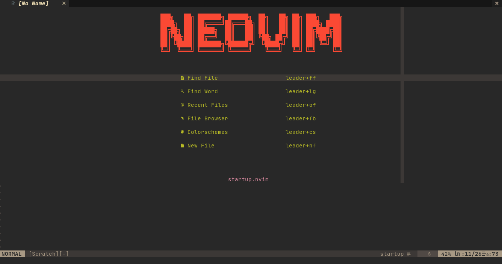
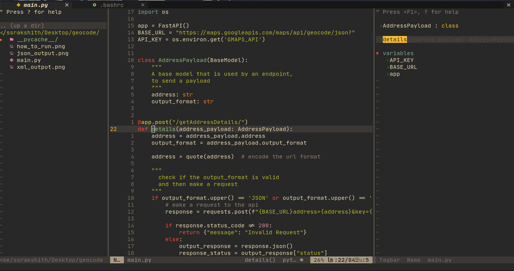

# nvim-configs

## About

Config for my neovim setup, includes plugins, LSP and my preferred key maps

## Previews

**Start Page**

**Project View**

## Plugins Used

Awesome plugins used in my workflow, that I am thankful for.

+ [Nerd Tree](https://github.com/preservim/nerdtree) - File Explorer
+ [Git Gutter](https://github.com/airblade/vim-gitgutter) - Show diff status of a git file
+ [Vim Fugitive](https://github.com/vim-airline/vim-airline) - For Git Version Control
+ [Airline](https://github.com/vim-airline/vim-airline) - Status Line
+ [Tagbar](https://github.com/preservim/tagbar) - Navigate between tags
+ [GutenTags](https://github.com/ludovicchabant/vim-gutentags) - To generate tags
+ [Markdown Preview](https://github.com/iamcco/markdown-preview.nvim) - To preview markdown files
+ [Emmet Plugin](https://github.com/mattn/emmet-vim) - Emmet Plugin for vim
+ [nvim-cmp](https://github.com/hrsh7th/nvim-cmp) - Nvim Auto Completion
+ [Utlisnips](https://github.com/SirVer/ultisnips) - Code Snippets
+ [Treesitter](https://github.com/nvim-treesitter/nvim-treesitter) - Syntax highlighting

